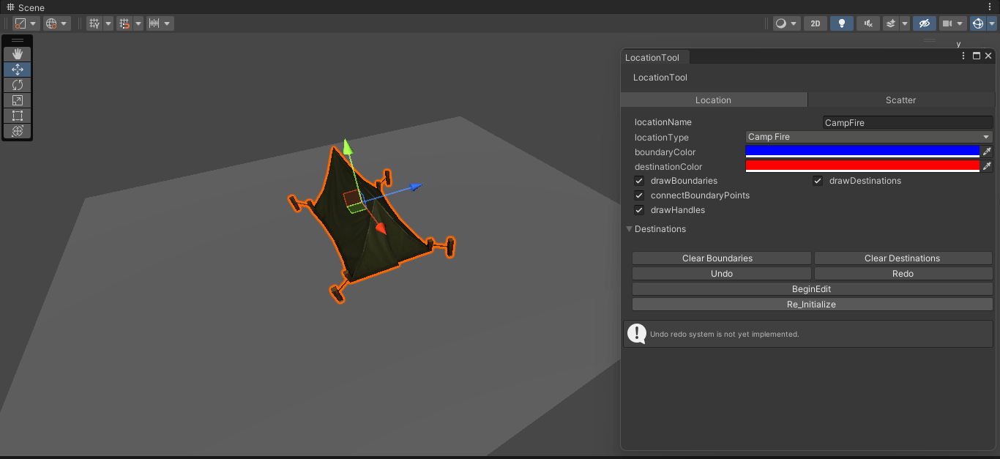

# Location tool
Primarily the **Location tool** is designed to give more context to game objects, mostly to be used by AI characters. With this tool any game object can be converted to a location and its various properties can be set for example boundaries, important places and type of location etc.

All locations are stored globally, during run-time the AI characters can poll for locations of interests.

Location tool is a programmer centric tool and requires a fair bit of programming knowledge to use.



## Setting up a location
1. Download this repository and import into unity. 
2. To open **LocationTool** window **MenuBar > CodeCreatePlay > LocationTool > LocationTool.**
3. To create a new location with empty game object **MenuBar > CodeCreatePlay > LocationTool > NewLocation.** 
4. To convert an existing game object to Location select the game object in scene hierarchy **MenuBar > CodeCreatePlay > LocationTool > ConvertToLocation.**
5. After a location is created, its various settings can be edited in location tool window.
6. To create boundaries of a location **( in edit mode ) control + left mouse button.**
7. To create destinations in a location **( in edit mode ) shift + left mouse button.**
8. All location are stored globally, a game object with **LT_Globals** tag and a **LT_GLobals** component should be created before accessing any locations from code, **MenuBar > CodeCreatePlay > LocationTool > Add LT_Globals.**
9. All location search related method must be called in Start method.

```
using CodeCreatePlay.LocationTool;


public class AI_Character : MonoBehaviour
{
    [HideInInspector] public LT_Globals lt_globals = null;
    [HideInInspector] public LocationBase currentLocation = null;
    [HideInInspector] public Vector3 currentDest;
    

    private void Start()
    {
        var lt_globals_go = GameObject.FindGameObjectWithTag("LT_Globals");

        if (lt_globals_go)
            lt_globals = lt_globals_go.GetComponent<LT_Globals>();

        // get all locations
        var allLocations = lt_globals.Locations;

        // get a random location of category, returns null if none found
        currentLocation = lt_globals.GetRandomLocation(LocationCategory.Area);

        // get a location by name, returns null if none found
        currentLocation = lt_globals.GetLocation("Inn");

        // get all destinations in a location
        var allDestinations = currentLocation.destinations;

        // get a random destination
        currentDest = currentLocation.GetRandomDestination();
    }
``` 

10. An example usage with unity's NavMesh agent.

```
using UnityEngine;
using CodeCreatePlay.LocationTool;


[RequireComponent(typeof(NavMeshAgent))]
public class AI_Character : MonoBehaviour
{
    public NavMeshAgent agent = null;
    [HideInInspector] public LT_Globals lt_globals = null;
    [HideInInspector] public LocationBase currentLocation = null;
    [HideInInspector] public Vector3 currentDest;
    

    private void Start()
    {
        var lt_globals_go = GameObject.FindGameObjectWithTag("LT_Globals");
        agent = GetComponent<NavMeshAgent>();

        if (lt_globals_go)
            lt_globals = lt_globals_go.GetComponent<LT_Globals>();

        // get a random location of type CampFire, at least one location of type CampFire must exist in scene 
        currentLocation = lt_globals.GetRandomLocation(LocationCategory.CampFire);

        // get a random destination in this location
        currentDest = currentLocation.GetRandomDestination();

        // set agent's destination to current destination
        agent.SetDestination(currentDest);
    }
}
```

## Integrating location tool in an existing project
Location tool can be easily integrated into existing projects, the best way would be to convert prefabs into locations, the changes would be reflected in the entire scene.

## Known issues
Sometimes **Location tool** stops updating, to fix this simply **ReInitialize** **LocationTool window > ReInitialize button.**

## Support

## Demo 
